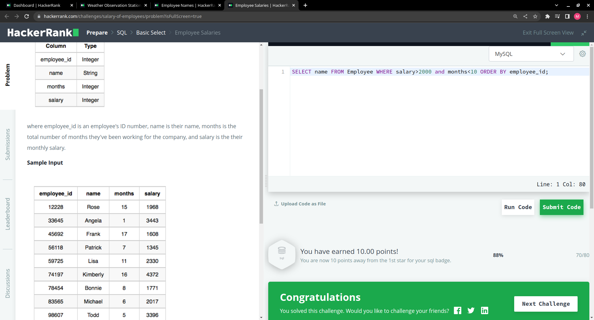
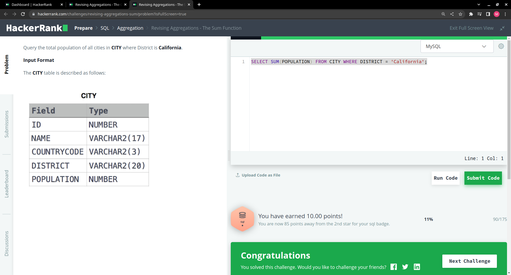
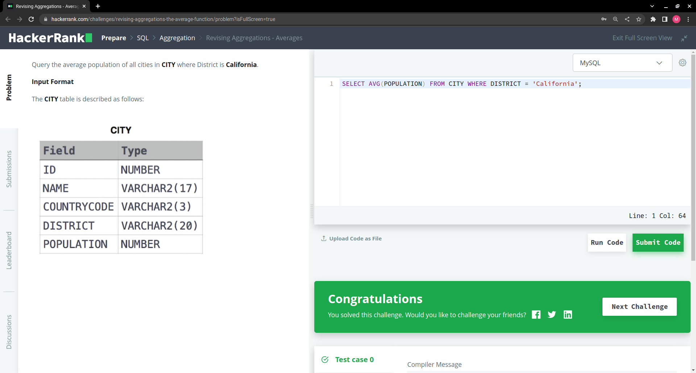
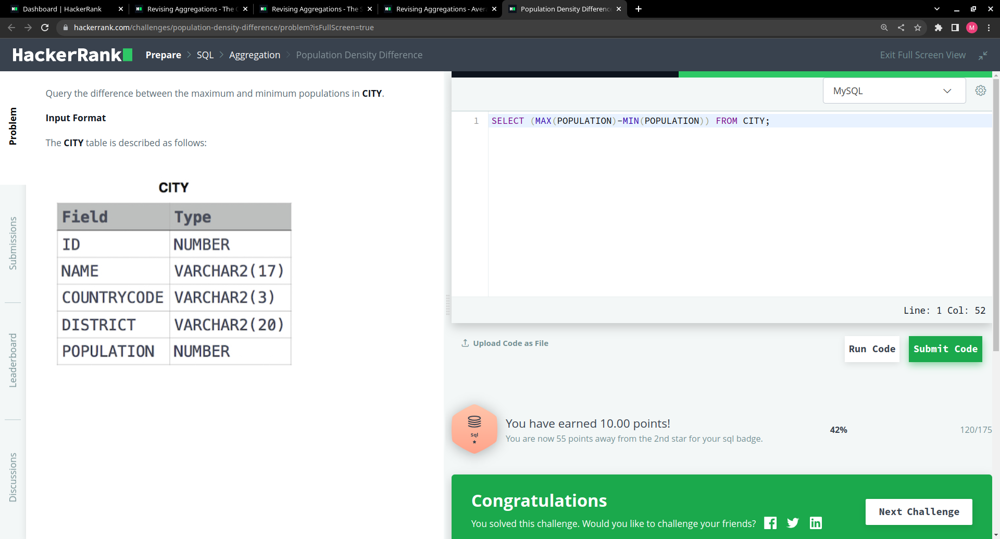

# This is my HW12
## Section 3: Aggregation

The Count Function:  
  

Revising Aggregations - The Sum Function:  

Revising Aggregations - Averages:   

Average Population:   

Population Density Difference:   

