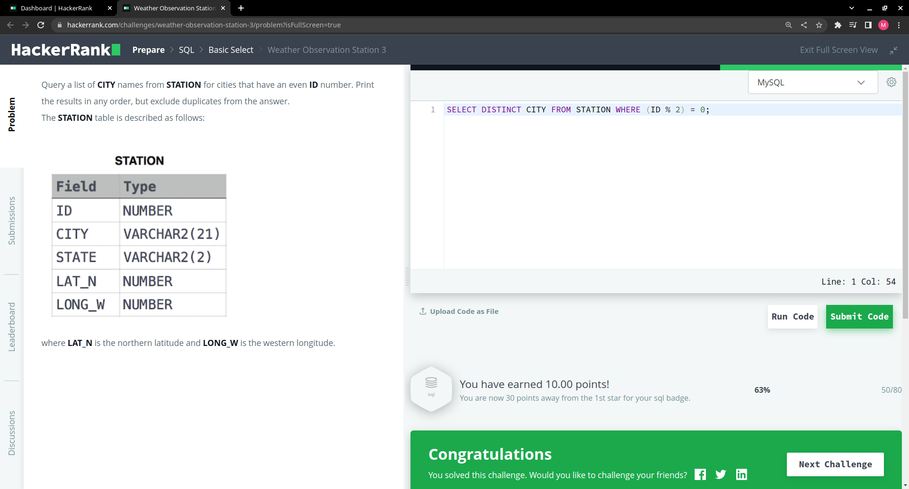
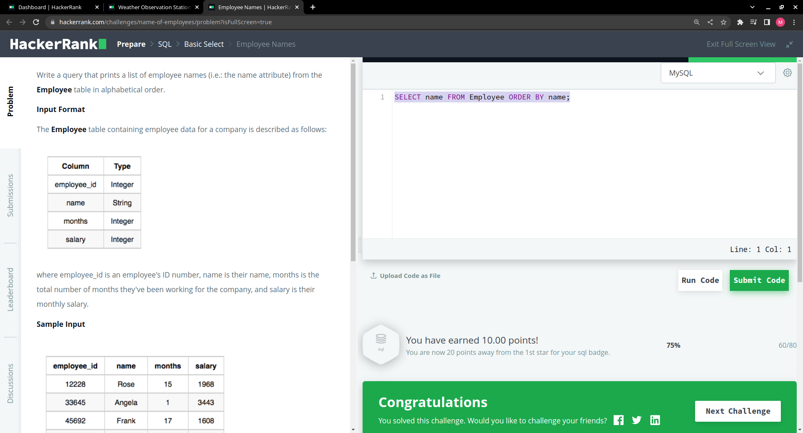
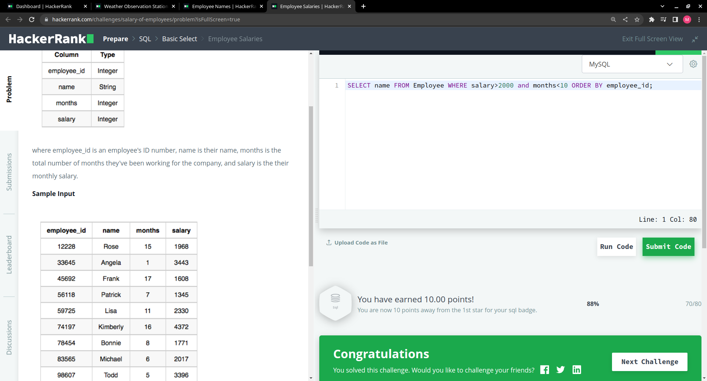

# This is my HW12  
## Section 2: 

Weather Observation Station 3:

Another way to answer this question:
> SELECT DISTINCT CITY FROM STATION WHERE MOD(ID,2)= 0;

Employee Names:

Employee Salaries:

