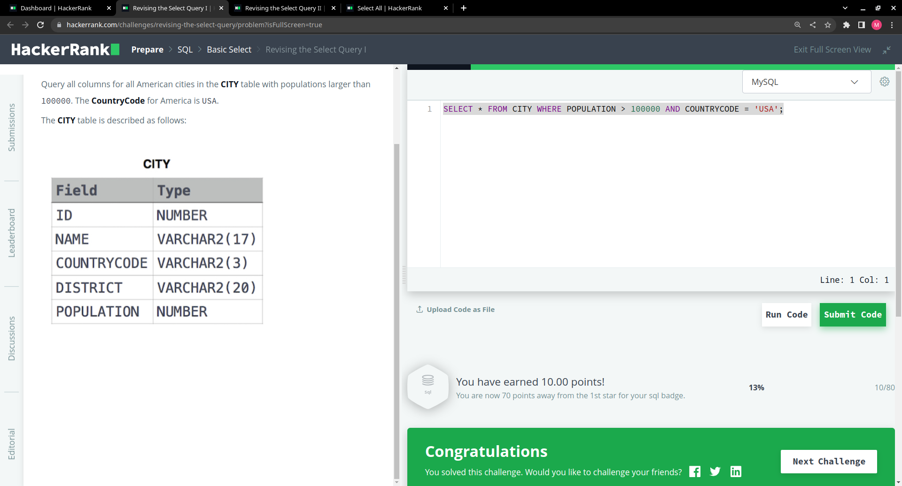
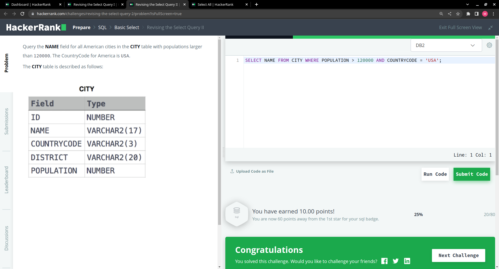
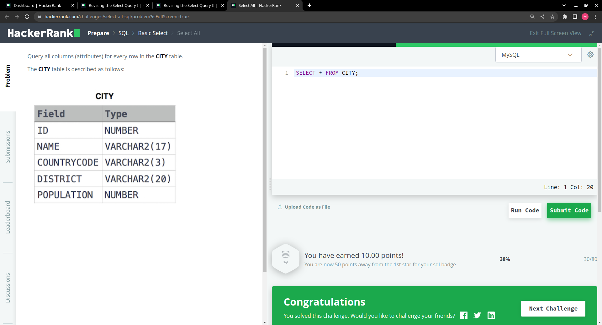

# This is my HW12
## Section 1: SELECT

Revising the select query 1:

Revising the select query 2:

Select all:

Select by ID:

## Section 2: 

Weather Observation Station 3:

Another way to answer this question:
> SELECT DISTINCT CITY FROM STATION WHERE MOD(ID,2)= 0;

Employee Names:

Employee Salaries:

